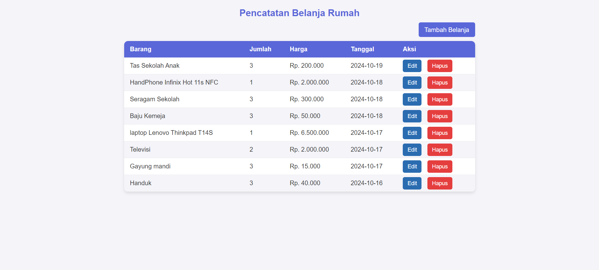

# 📜 Aplikasi Pencatatan Belanja Rumah 🛒

Selamat datang di **Aplikasi Pencatatan Belanja Rumah**! 🎉 
Aplikasi ini dirancang untuk membantu Anda mencatat semua belanjaan dengan mudah dan efisien. Dengan aplikasi ini, Anda dapat mengelola catatan belanjaan Anda, mulai dari barang yang dibeli hingga total pengeluaran. 🏷️💰

## 🚀 Fitur Utama

- **Catatan Belanja**: Tersedia fitur untuk mencatat barang belanjaan, jumlah, harga, dan tanggal belanja dengan langkah-langkah yang mudah diikuti.
- **Tampilan Interaktif**: Antarmuka yang sederhana namun menarik untuk pengalaman pengguna yang menyenangkan.
- **Penyimpanan Data**: Simpan dan kelola data resep menggunakan teknologi **SQLite**.

## 📚 Teknologi yang Digunakan

Proyek ini dibangun menggunakan teknologi-teknologi berikut:

- **HTML5**: Untuk struktur halaman aplikasi.
- **CSS3**: Untuk styling yang membuat aplikasi lebih menarik dan responsif.
- **PHP**: Untuk logika backend dan pengelolaan data resep.
- **SQLite**: Sebagai database untuk menyimpan data resep makanan daerah.

## 💻 Dokumentasi

Ini adalah halaman ketika pengguna masuk pertama kali ke aplikasi ini, di mana pengguna akan diarahkan untuk memasukkan nama lengkap dan juga email.

--------------------------------------------------------

Ini adalah halaman Utama, di mana pengguna bisa melihat semua catatan belanja yang telah ditambahkan dan mengelola belanjaan mereka sendiri.

--------------------------------------------------------

Ini adalah halaman Tambah Belanja, di mana pengguna bisa menambahkan catatan belanja baru agar dapat dilihat dan dikelola.

--------------------------------------------------------

Ini adalah halaman Edit Belanja, di mana pengguna bisa mengedit atau memperbarui catatan belanja yang sudah ditambahkannya.

--------------------------------------------------------

#  🙏🏻Terimakasih Sudah Berkunjung 🙏🏻

Jangan lupa untuk follow dan likenya juga ya teman - teman 😎
